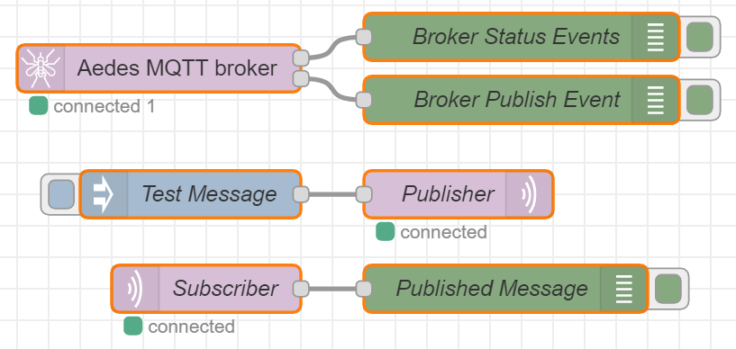

# node-red-contrib-aedes
MQTT Broker for Node-RED based on [Aedes](https://github.com/moscajs/aedes).

You can use the MQTT protocol in Node-RED without an external MQTT broker like Mosquitto.


[](https://github.com/standard/semistandard)
[](https://www.codacy.com/manual/martin-doyle/node-red-contrib-aedes?utm_source=github.com&amp;utm_medium=referral&amp;utm_content=martin-doyle/node-red-contrib-aedes&amp;utm_campaign=Badge_Grade)
<!--
[](https://david-dm.org/martin-doyle/node-red-contrib-aedes)
[](https://david-dm.org/martin-doyle/node-red-contrib-aedes#info=devDependencies)
-->
[](https://github.com/ellerbrock/open-source-badge/)
[](https://www.npmjs.com/node-red-contrib-aedes)

## Background
This node was created because the original MQTT broker [node-red-contrib-mqtt-broker](https://github.com/zuhito/node-red-contrib-mqtt-broker) uses [mosca](https://github.com/moscajs/mosca) which is no longer maintained.
## Installation
You can install the node directly within the editor by using the [Palette Manager](https://nodered.org/docs/user-guide/editor/palette/manager).

To install the node from the command-line, you can use the following command from within your user data directory (by default, ```$HOME/.node-red```):
```sh
npm install node-red-contrib-aedes
```
## Flows
Just put this node on Node-RED and hit the deploy button. The MQTT Broker will run on your Node-RED instance.


## Features
- Standard TCP Support
- WebSocket Support via port or path
- SSL / TLS
- Message Persistence (In-memory, LevelDB or MongoDB)
 
For more information see [Aedes](https://github.com/moscajs/aedes/blob/master/README.md#features).

## Server without public IP or behind firewall
If your server is behind a firewall or you cannot open any ports other than the standard http/https ports, the MQTT broker node can be accessible by public clients through a WebSocket path.

When your Node-RED server address is `https://yourserver/`, you can set the WebSocket to bind to, e.g., `"/ws/mqtt"` path, to have `wss://yourserver/ws/mqtt` WebSocket at port `443`.

You can also bind the WebSocket to the root `"/"` path and having `wss://yourserver/` WebSocket listening at port `443` (or `ws://yourserver/` at port `80`).
 
## License
 
 Licensed under [MIT](./LICENSE).
